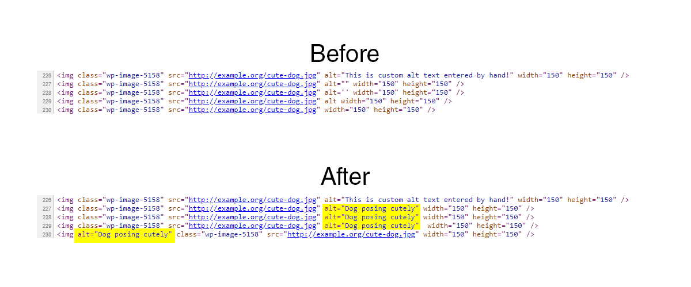

Auto Fill Alt Tags (WordPress Plugin)
==

_Automatically fills in alt tags for your images in the post content._

    Contributors: radgh
    Donate link: https://paypal.me/radgh
    Tags: pages, noindex, robots
    Requires at least: 3.8
    Tested up to: 4.9.4
    Stable tag: 1.0
    License: GPLv3
    License URI: http://www.gnu.org/licenses/gpl-3.0.txt

## Description ##

Automatically fills in alt tags for your images in the post content. Preserves existing alt text if it exists. If alt text is not entered for an attachment, the caption or title will be used instead. No configuration necessary.

* Does not override existing alt text.
* Does not provide alt text for external images, or images that are not in the media library.

## Installation ##

1. Upload the plugin files to `/wp-content/plugins/auto-fill-alt-tags/`, or install the plugin through the WordPress plugins screen directly.
1. Activate the plugin through the 'Plugins' screen in WordPress
1. Edit a page, look for the checkbox above the "Publish" or "Update" button near the top-right.
1. (Optional) verify it works by viewing your page and then right-click, "View Source", and look for the meta tag with the name "robots" and value "noindex".
1. (Optional) Extend the functionality to posts or other custom post types by reading the FAQ's.

## Frequently Asked Questions ##

None yet.

## Screenshots ##

## Changelog ##

#### 1.0
* First release

## Upgrade Notice ##

Nothing to note, this is the first version.